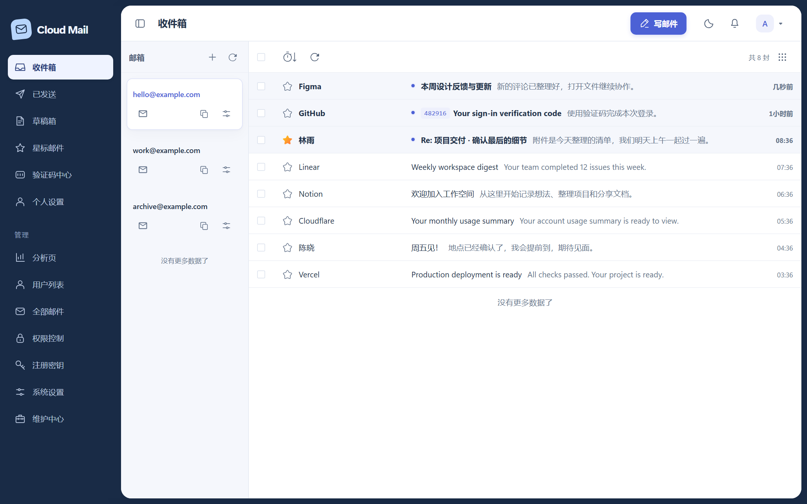
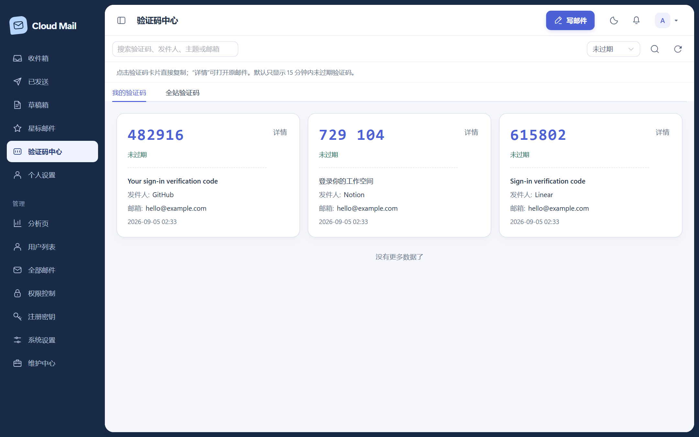
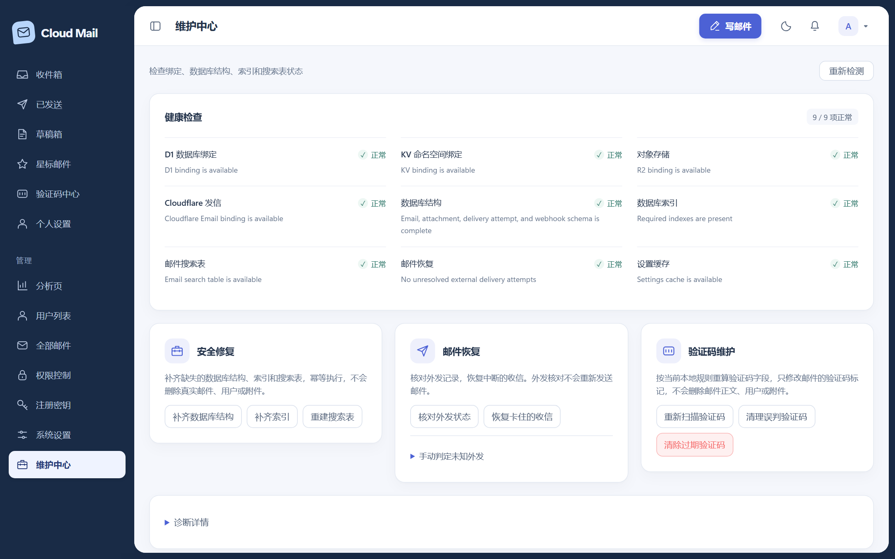
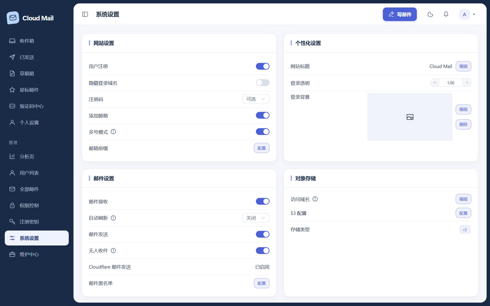
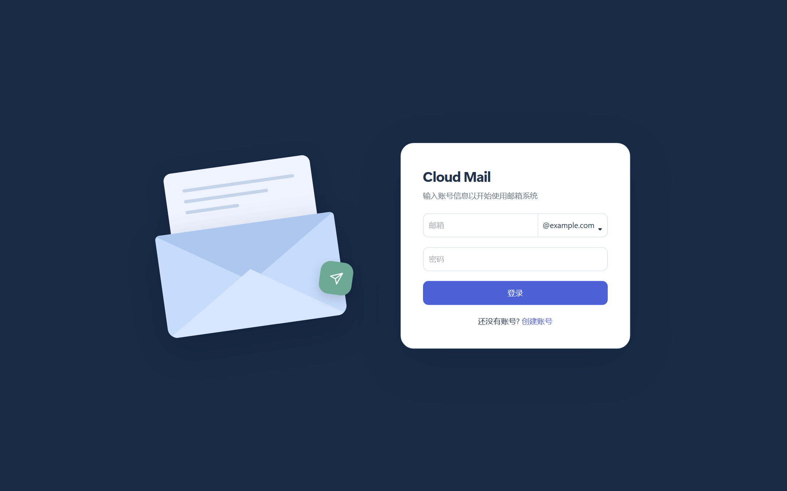
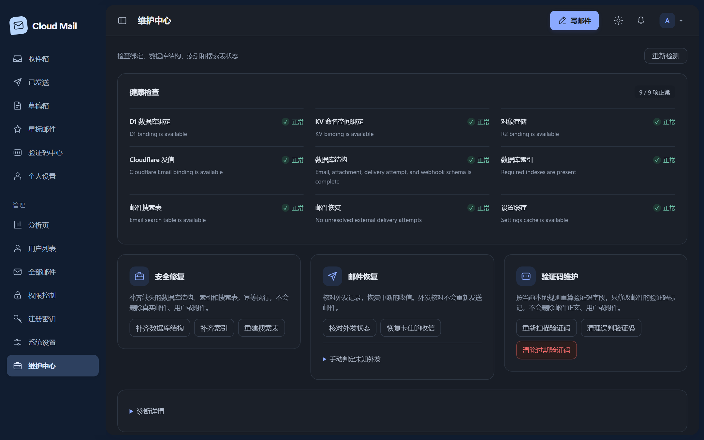
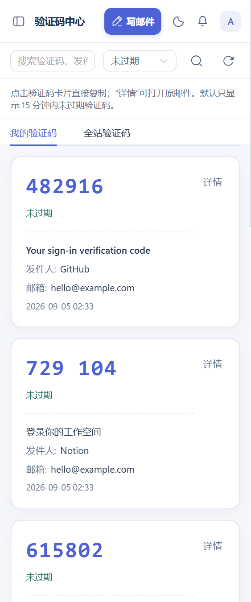
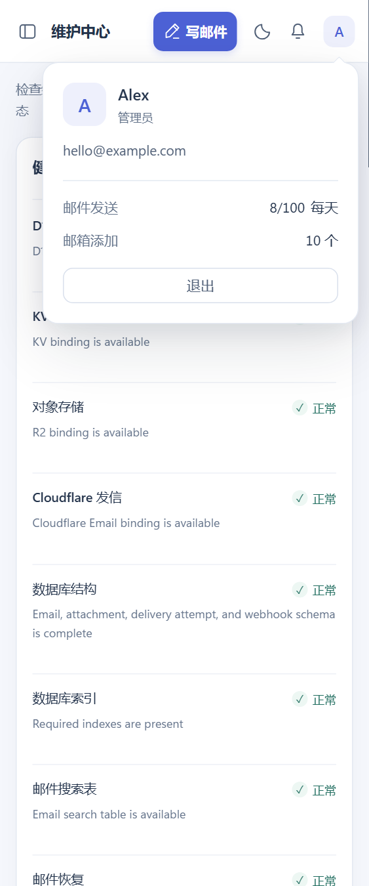

<div align="center">


# Cloud Mail

**基于 Cloudflare Workers 的自托管邮箱系统**

一个 Worker 承载前后端 · 数据归自己所有 · 不开 AI 也能用的验证码中心 · 内置维护后台

<p>
  
  
  
  
  
  
</p>

[简体中文](README.md) · [English](README-en.md)

</div>

---

适合个人、小团队或临时邮箱场景长期自用。本仓库作为独立项目维护，不再依赖 GitHub fork 同步；持续优化方向：**稳定收发、低成本运行、数据可维护、验证码读取更快**。

## 📸 界面预览

以下截图来自当前版本的真实界面，使用本地演示数据，不包含真实邮箱、凭据或线上诊断信息。

新版采用深墨蓝导航、信纸式工作区和统一线条图标，支持深浅主题、键盘操作与手机布局。原有网站标题、登录背景、透明度、语言及公告设置继续生效。

| 收件箱 | 验证码中心 |
| :---: | :---: |
|  |  |
| **维护中心** | **系统设置** |
|  |  |
| **登录页** | **深色主题** |
|  |  |

<details>
<summary>查看手机界面</summary>

<p>
  
  
</p>

</details>

## ✨ 项目特点

- 🧩 **一体化部署** — 一个 Cloudflare Worker 同时承载后端 API 和 Vue 前端静态资源。
- 🔒 **数据归自己所有** — 邮件、用户、设置保存在自己的 D1 / KV / R2 资源里。
- 💸 **低成本验证码中心** — 默认本地规则识别验证码，不开 AI 也能正常使用。
- 🛠️ **维护中心内置** — 一键检查 D1/KV/R2/AI/发信绑定，补齐字段、索引和搜索表。
- 🚀 **面向真实部署优化** — Workers Git、GitHub Actions、本地 Wrangler 三种部署路径。
- 🛡️ **安全默认值更稳** — Webhook 签名、CORS 收紧、HTML 清洗、附件鉴权开箱即用。

## 🗂️ 功能概览

### 邮箱基础能力

- 多域名、多邮箱地址管理；收件箱、已发送、草稿箱、星标、全部邮件。
- 发送、回复、抄送、密送、附件和内嵌图片。
- Resend 发信状态回调，默认要求 webhook 签名校验；事件去重且状态只允许单调前进，旧部署可显式开启未签名兼容。
- 可选 Cloudflare Email Routing 发信绑定；可选 R2 附件存储。
- 收信附件先持久化写入意图，再写对象存储；中断后由有界恢复任务核对真实对象，不会把缺失附件的邮件伪装成接收成功。

### 验证码中心

- 独立页面，支持「我的验证码」和「全站验证码」（管理员）。
- 点击验证码卡片直接复制，右上角「详情」跳转邮件详情。
- 默认本地规则识别常见验证码（多语言标签、上下文打分、负面上下文过滤），**不需要开启 Workers AI，不产生 AI 费用**。
- AI 只作可选兜底：本地规则识别不到且后台开启 AI 兜底时才会调用。
- 默认展示最近 15 分钟内的验证码，到时自动隐藏并停止复制；页面切回前台时立即复核。15 分钟是本系统的展示窗口，实际有效期以原邮件为准。
- 请求失败可重试，刷新失败保留当前列表；切换「我的 / 全站」或筛选时清空旧结果，避免混淆。

### 管理员能力

- 用户、邮箱、角色权限管理；注册密钥、用户状态、发信次数限制。
- 全部邮件检索、批量删除、邮件详情查看。
- 分析页：用户、邮件、收发趋势等图表。
- 系统设置：站点标题、登录页、公告、黑名单、转发、Turnstile 人机验证等。

### 维护中心

- D1 / KV / R2 / AI / 发信绑定状态检查。
- 数据库字段、索引、搜索表健康检查与幂等修复（补齐结构、补齐索引、重建搜索表）。
- 外部投递 attempt 状态与 `UNKNOWN` / `PENDING_ACK` 数量检查；“核对外发状态”只修复本地 D1，不会再次调用发信供应商。
- 验证码维护：重新扫描、清理误判、清理过期。
- 健康检查统一展示状态和说明；数据库修复、邮件恢复、验证码维护按用途分组。人工判定未知外发与诊断详情可按需展开，操作前保留确认，执行期间显示忙碌状态并禁用其他维护操作。

### 性能与安全

- lite 邮件与收藏列表只查询附件数量，正文和完整附件元数据按需加载；详情缓存使用 100 项 / 8 MiB 的 LRU 预算；`email_search` 搜索表 + 组合索引优化 D1 查询。
- 设置、权限、角色短缓存；附件匹配 Map 化。
- 分析页开启缓存时按访问生成时区快照，沿用 35 分钟有效期，命中不续期；过期后的首次访问会等待聚合。定时任务不再预热统计，关闭缓存则实时查询。
- 前端 Vite 分包：Element Plus、ECharts、Dexie、Vue vendor 独立 chunk；TinyMCE、Turnstile 按需加载。
- Worker CORS 默认收紧（`cors_origins` 显式放行）；公告和邮件 HTML 基础安全清洗；public 接口参数绑定防注入；所有 JSON API 使用端点级正文上限。
- 注销、401 和账号切换会清除认证态、动态权限路由及邮件缓存，但保留主题、语言和按账号隔离的本地草稿；草稿及附件通过 Dexie 事务同步提交或回滚。
- 静态页面启用兼容 TinyMCE、Turnstile、PWA 和邮件 Shadow DOM 的 CSP 与安全响应头，脚本策略不允许 `unsafe-inline`。

## 🧰 技术栈

| 模块 | 技术 |
| --- | --- |
| 运行平台 | Cloudflare Workers |
| 后端框架 | Hono |
| 数据库 | Cloudflare D1 + Drizzle ORM |
| 缓存 | Cloudflare KV |
| 文件存储 | Cloudflare R2（可选） |
| 前端 | Vue 3 + Vite + Element Plus |
| 图表 | ECharts |
| 邮件解析 | postal-mime |
| 发信 | Resend / Cloudflare Email（可选） |

## 🚀 快速开始

> 📘 第一次部署建议先看 **[部署教程](doc/部署教程.md)**：从准备资源到收发信打通的逐步操作，含 Email Routing 配置、发信开关、可选功能和排障速查。本节是命令与变量的速查表。

### 准备 Cloudflare 资源

| 资源 | 必需 | 绑定名 |
| --- | :---: | --- |
| Workers | ✅ | — |
| D1 数据库 | ✅ | `db` |
| KV Namespace | ✅ | `kv` |
| R2 Bucket | 可选 | `r2` |
| Workers AI | 可选 | `ai` |
| 自定义域名 + 邮箱域名 DNS / Email Routing | ✅ | — |

> 💡 从旧仓库或旧 Worker 切换过来时，继续绑定原来的 `D1_DATABASE_ID`、`KV_NAMESPACE_ID`、`R2_BUCKET_NAME`，数据不会因为换仓库而丢失。真正要避免的是部署时误绑定到新的空 D1 / KV。

### 重要环境变量

敏感值放 Cloudflare Workers Secrets 或 GitHub Secrets，不要提交到仓库。

| 变量 | 必填 | 说明 |
| --- | :---: | --- |
| `domain` / `DOMAIN` | ✅ | 邮箱域名 JSON 数组，例如 `["example.com"]` |
| `admin` / `ADMIN` | ✅ | 管理员邮箱 |
| `jwt_secret` / `JWT_SECRET` | ✅ | 登录 token 密钥，建议随机 UUID 或更长随机串 |
| `init_secret` | 推荐 | `/api/init` 初始化接口独立密钥；未配置时回退使用 `jwt_secret` |
| `oauth_auto_register` | 可选 | 填 `true` 时 LinuxDo OAuth 新用户可绕过站点注册开关自动注册（旧行为）；默认尊重注册开关 |
| `project_link` / `PROJECT_LINK` | 可选 | 登录页 GitHub 角标指向的地址；未配置指向官方仓库，填 `false` 隐藏角标，非 `http(s)` 的值同样隐藏 |
| `D1_DATABASE_NAME` | ✅ | D1 数据库名，默认 `mail` |
| `D1_DATABASE_ID` | ✅ | D1 数据库 ID |
| `KV_NAMESPACE_ID` | ✅ | KV Namespace ID |
| `CUSTOM_DOMAIN` | 推荐 | Worker 自定义域名 |
| `R2_BUCKET_NAME` | 可选 | 附件对象存储桶 |
| `CORS_ORIGINS` | 可选 | 额外跨域来源 JSON 数组字符串 |
| `RESEND_WEBHOOK_SECRET` | 推荐 | Resend webhook 签名密钥 |
| `RESEND_WEBHOOK_ALLOW_UNSIGNED` | 可选 | 仅兼容旧部署时填 `true` |
| `AI_MODEL` | 可选 | Workers AI 兜底识别模型 |
| `ANALYSIS_CACHE` | 可选 | 分析页缓存开关 |
| `CF_EMAIL` | 可选 | 是否启用 Cloudflare Email 发信绑定 |

### 部署方式

<details>
<summary><b>方式一：Cloudflare Workers Git 集成（推荐）</b></summary>

在 Cloudflare Dashboard 连接 GitHub 仓库，部署命令使用仓库提供的脚本：

```text
node scripts/cloudflare-workers-git-deploy.mjs
```

如果 Cloudflare 项目根目录设置成了 `mail-worker`，改为：

```text
node ../scripts/cloudflare-workers-git-deploy.mjs
```

脚本会先显式构建 `mail-worker/dist`，再生成临时 wrangler 配置，用环境变量显式写入 D1 / KV / R2 绑定，然后部署。建议配置的构建变量：

- `D1_DATABASE_NAME`（默认 `mail`）、`D1_DATABASE_ID`、`KV_NAMESPACE_ID`
- `R2_BUCKET_NAME`、`CUSTOM_DOMAIN`、`NAME`（默认 `cloud-mail`）均可选
- `CF_EMAIL` 填 `true` 时启用 Cloudflare Email 发信绑定
- `CLOUD_MAIL_WRANGLER_VERSION` 可选，默认 `4.92.0`

> Git 集成脚本只负责构建和部署，无法在 Worker 上线前初始化远程 D1。首次部署打开站点会进入 `/setup`，页面会检查绑定和变量，并依次给出 `POST /api/init`（初始化数据库）和 `POST /api/init/admin`（创建管理员）的命令。初始化密钥和管理员密码只由你在可信终端填写，页面不会读取或保存。

`GET /api/init/status` 是公开的只读启动检查接口，只返回 D1、KV 和必需变量是否已配置等布尔状态，不返回资源 ID、变量内容或密钥。

已有生产数据时，**务必确认三项指向旧资源**：

```text
D1_DATABASE_ID=原来的 D1 ID
KV_NAMESPACE_ID=原来的 KV ID
R2_BUCKET_NAME=原来的 R2 桶名（可选）
```

本地只验证不部署：

```powershell
$env:CLOUD_MAIL_DEPLOY_DRY_RUN='true'
node scripts/cloudflare-workers-git-deploy.mjs
```

> ⚠️ 如果 Cloudflare 自动创建了类似 `Add Cloudflare Workers configuration` 的 PR，并把项目识别成 `Framework: static` / `Output Directory: mail-vue`，**不要合并**。那会把前端源码当静态资源上传，导致 Worker 后端和 D1 / KV 绑定全部失效。应使用本仓库根目录的 `wrangler.jsonc`。

</details>

<details>
<summary><b>方式二：本地 Wrangler 直接部署</b></summary>

`mail-worker/wrangler.toml` 已配置 Worker 入口（`src/index.js`）、静态资源目录（`./dist`）和构建命令。

```powershell
cd mail-worker
corepack pnpm wrangler deploy
```

首次部署会进入 `/setup`。先把页面给出的 PowerShell 命令复制到可信终端初始化数据库。命令会隐藏询问 `jwt_secret`，不会把真实值写进命令历史：

```powershell
$cloudMailInitSecret = [Net.NetworkCredential]::new('', (Read-Host 'Cloud Mail init secret' -AsSecureString)).Password
try {
  Invoke-RestMethod -Method Post -Uri 'https://你的域名/api/init' -Headers @{ 'X-Cloud-Mail-Init-Secret' = $cloudMailInitSecret }
} finally {
  Clear-Variable cloudMailInitSecret -ErrorAction SilentlyContinue
}
```

数据库返回 `success` 后，再创建唯一的管理员账户。管理员邮箱取自 `admin` / `ADMIN` 环境变量；该接口只在管理员尚不存在时可用：

```powershell
$cloudMailInitSecret = [Net.NetworkCredential]::new('', (Read-Host 'Cloud Mail init secret' -AsSecureString)).Password
$cloudMailAdminPassword = [Net.NetworkCredential]::new('', (Read-Host 'Cloud Mail administrator password' -AsSecureString)).Password
try {
  $cloudMailAdminBody = @{ password = $cloudMailAdminPassword } | ConvertTo-Json -Compress
  Invoke-RestMethod -Method Post -Uri 'https://你的域名/api/init/admin' -Headers @{ 'X-Cloud-Mail-Init-Secret' = $cloudMailInitSecret } -ContentType 'application/json' -Body $cloudMailAdminBody
} finally {
  Clear-Variable cloudMailInitSecret, cloudMailAdminPassword, cloudMailAdminBody -ErrorAction SilentlyContinue
}
```

密码长度为 6–30 位；PowerShell 会负责 JSON 转义，因此引号、反斜杠等合法字符不会破坏请求。创建完成后即可登录后台配置 Resend、公告、验证码识别等业务选项。公开注册、OAuth 绑定和公开导入接口都不能创建管理员。

</details>

<details>
<summary><b>方式三：GitHub Actions 手动兼容部署</b></summary>

仓库包含 `.github/workflows/deploy-cloudflare.yml`。该工作流目前仅支持从 Actions 页面手动触发，并且必须把 `confirm_legacy_deploy` 填为 `true`；推送 `main` 不会自动运行，避免与 Cloudflare Workers Git 集成重复部署。

建议配置以下 Secrets / Variables：

`CLOUDFLARE_API_TOKEN`、`CLOUDFLARE_ACCOUNT_ID`、`CUSTOM_DOMAIN`、`DOMAIN`、`ADMIN`、`JWT_SECRET`、`D1_DATABASE_NAME`、`D1_DATABASE_ID`、`KV_NAMESPACE_ID`，以及可选的 `R2_BUCKET_NAME`、`RESEND_WEBHOOK_SECRET`（推荐）、`RESEND_WEBHOOK_ALLOW_UNSIGNED`、`CORS_ORIGINS`。

手动工作流执行后会完成：安装依赖 → 串行 Worker 全量测试、前端测试和 release build → 生成 `wrangler-action.toml` → 按 `D1_DATABASE_NAME` 检查/填充 D1 和 KV 绑定 → 部署 → 通过 `POST /api/init` 初始化数据库。自动初始化要求配置 `CUSTOM_DOMAIN`；`CORS_ORIGINS` 必须是 JSON 字符串数组，例如 `["https://admin.example.com"]`。工作流不会保留部署日志、输出部署 URL、删除 Actions 运行历史，也不会接收或记录管理员密码。

</details>

### ✅ 首次部署检查清单

1. 构建日志中没有 `Framework: Static` / `Output Directory: mail-vue` / `Create wrangler.jsonc` 等误识别提示。
2. Wrangler 输出的绑定里能看到 `env.db`、`env.kv`、`env.assets`。
3. 打开 `/setup`，确认 D1、KV、`domain`、`admin`、`jwt_secret` 均显示已就绪。
4. 按 `/setup` 提示执行隐藏输入凭据的 PowerShell 初始化命令，返回 `success` 后点击「重新检测」。
5. 页面显示数据库已就绪后，按提示调用 `POST /api/init/admin`，在请求 JSON 中设置 6–30 位管理员密码；返回 `success` 后再次检测。
6. 使用 `admin` / `ADMIN` 中配置的邮箱和刚设置的密码登录后台 → 维护中心，检查 D1 / KV / R2 / AI / 发信绑定状态。
7. 如提示缺字段、缺索引或缺搜索表，按顺序执行「补齐数据库结构」「补齐索引」「重建搜索表」。
8. 进入系统设置，配置 Resend、公告、验证码识别等业务选项。

Bootstrap readiness 会把同一 Worker isolate 内的 `ready=true` 结果按版本短暂缓存（15 秒），失败或未初始化结果不会缓存；`/api/init`、管理员创建和维护中心结构/索引修复会主动失效该缓存。当前升级还会幂等创建 `idx_verify_record_ip_type`（`verify_record(ip, type)`）索引。旧数据库部署新版本后，仍需通过受保护的 `/api/init` 或维护中心「补齐数据库结构/补齐索引」完成升级；不要直接在生产 D1 手工删除或改写历史数据。

<details>
<summary><b>从旧 Cloudflare 项目切到本仓库</b></summary>

1. 先在 Cloudflare Dashboard 记录当前 D1、KV、R2 绑定信息。
2. 新 GitHub 连接使用 `node scripts/cloudflare-workers-git-deploy.mjs` 作为部署命令。
3. 构建变量里填回旧资源 ID，不要留空让 Wrangler 自动创建新资源。
4. 部署完成后进入维护中心，确认 `db`、`kv`、`assets`、`r2` 状态正常。
5. 如页面显示缺字段或缺索引，按维护中心提示执行幂等修复。
6. 确认收件箱、验证码中心、附件预览、发信设置都正常后，再清理旧仓库连接。

</details>

## 🧑‍💻 本地开发

建议使用 Node.js 22 和 pnpm。

```powershell
# 安装依赖
cd mail-worker && corepack pnpm install
cd ../mail-vue && corepack pnpm install

# 启动 Worker（http://127.0.0.1:8787）
cd mail-worker && corepack pnpm dev

# 启动前端（默认请求 http://127.0.0.1:8787/api）
cd mail-vue && corepack pnpm dev
```

发布前检查：

```powershell
# 从仓库根目录运行共享门禁：Worker 串行全量、前端全量、release build
node scripts/verify.mjs

# 依赖公告（固定使用仓库声明的 pnpm 大版本）
npx pnpm@10.11.1 --prefix mail-worker audit
npx pnpm@10.11.1 --prefix mail-vue audit
```

`.github/workflows/ci.yml` 会在 `main` 推送和 Pull Request 上执行同一门禁，兼容的手动部署工作流也会在 Wrangler 部署前执行它。**Cloudflare Git 部署不重跑单元测试**：部署路径带 `--deploy` 只执行部署配置自检和 release build，同一 commit 的单元测试由上面这条 CI 承担，避免在两处各跑一遍。Windows 上如 workerd 因 Unicode 路径不稳定，可把内容一致的 Worker 测试镜像放在纯 ASCII 路径，并通过 `CLOUD_MAIL_WORKER_TEST_DIR` 指向该目录；CI 默认直接使用仓库内的 `mail-worker`。

当前依赖审计为 Worker `0` 项、前端仅保留 1 项 Moderate：[`GHSA-fgmj-fm8m-jvvx`](https://github.com/advisories/GHSA-fgmj-fm8m-jvvx)。该公告仅影响使用内置 tooltip 且未自定义 formatter 的 ECharts `lines` 系列；本项目分析页只使用 `line`、`bar` 和 `pie` 系列，并对唯一来自邮件的发件人 tooltip 名称显式做 HTML 转义，因此当前调用路径不触发该漏洞。上游修复仍要求 ECharts `6.1.0`，属于未授权的主版本升级；后续升级 ECharts 6 时需单独完成图表兼容回归。

## 📮 公开自动化发件接口

`POST /api/public/sendEmail` 适合自动化脚本使用。先通过现有的 `POST /api/public/genToken` 获取公共令牌，然后把令牌原样放入 `Authorization` 请求头，不要添加 `Bearer` 前缀。

```bash
curl -X POST "https://mail.example.com/api/public/sendEmail" \
  -H "Content-Type: application/json" \
  -H "Authorization: YOUR_PUBLIC_TOKEN" \
  -d '{
    "sendEmail": "noreply@example.com",
    "receiveEmail": ["recipient@example.com"],
    "subject": "自动化通知",
    "content": "<p>任务已完成</p>",
    "text": "任务已完成",
    "name": "Cloud Mail",
    "attachments": [
      {
        "filename": "report.pdf",
        "contentType": "application/pdf",
        "content": "JVBERi0xLjQK"
      }
    ]
  }'
```

成功响应中的 `data` 直接沿用现有发件链路，类型为邮件结果数组：

```json
{
  "code": 200,
  "message": "success",
  "data": [
    {
      "emailId": 123,
      "status": 6
    }
  ]
}
```

附件 `content` 支持标准 Base64，也兼容 `data:*;base64,...`。文件名会去除路径和控制字符；`contentType` 缺失或不合法时使用 `application/octet-stream`。公开调用方传入的 `path`、`url`、`key`、`contentId`、`disposition`、`size` 等字段不会进入核心发件对象，附件仍通过受保护的下载接口访问。

稳定性限制：`POST /api/email/send` 与 `POST /api/public/sendEmail` 共用同一套有界 JSON 读取和输入规范化。每次最多 10 个收件人和 10 个附件；单附件解码后最大 10 MiB，附件解码后合计最大 16 MiB；同步 JSON 请求体最大 24 MiB；HTML `content` 与纯文本 `text` 的 UTF-8 大小合计最大 1 MiB。公开接口不支持回复模式，且整个部署每小时最多调用 100 次。所有格式、收件人和大小校验都会在邮件、附件或对象写入前完成。站外发信还受实际通道限制：Cloudflare Email 整封邮件最大 5 MiB，Resend 整封邮件（附件 Base64 编码后）最大 40 MB，接口会在落库和调用供应商前明确拒绝超限邮件。发件开关、账号归属、角色权限、域名权限和发送额度仍由现有发件链路统一校验。

计数语义：角色发件额度会在所有请求、权限、账号和供应商大小预检通过后，通过 D1 条件更新原子预留。预留后的附件存储失败、供应商失败或结果不确定仍计为一次发送尝试，避免供应商实际成功但客户端超时后退款并重复发送；预检阶段的 400/413 不计额度。公开接口的每小时 100 次限制同样使用 D1 原子小时桶，不再依赖 KV `get → put`。注册密钥也会先原子扣次，再以 D1 `batch()` 事务创建用户和主账号；创建失败时回滚用户数据并补回密钥次数。

收信附件恢复：历史附件 `status=0` 继续视为 `READY`，`1` 为 `UNUSED`，新写入使用 `PENDING=2` 和 `FAILED=3`。新附件会先在 D1 写入 `PENDING`，对象成功写入 R2/KV/S3 后才转 `READY`；普通下载、管理员下载、公开内嵌图片和附件列表都只接受 `READY`。一封入站邮件最多处理 10 个附件，只有全部附件 `READY`（或确实没有附件）时，父邮件才会从 `SAVING` 变为可见状态。恢复服务单次最多处理 2 封，定时任务为给同一 Workers invocation 的其他维护工作保留 Free 套餐 50 次 subrequest 余量，每轮只领取 1 封；同一邮件的附件状态按结果集合批量写回 D1，不再逐附件执行更新。每封邮件先通过 D1 条件更新取得 5 分钟恢复租约，重叠 cron 只有一个 runner 会探测对象。R2/S3 使用元数据探测，KV 读取后立即取消流；KV 首次空读至少延后 5 分钟后才允许再次确认，临时存储故障则退避 1 小时，避免最终一致性或并发任务把有效对象误判为丢失。

外部投递恢复：站外发信在调用 Cloudflare Email 或 Resend 前先写入 `delivery_attempt`，状态依次使用 `PREPARED`、`IN_FLIGHT`、`PENDING_ACK`、`ACCEPTED`、`FAILED`、`UNKNOWN`。同一邮件只允许一个 attempt，非空 provider message id 也保持唯一映射。Resend 请求携带稳定 attempt key 作为幂等键；Cloudflare Email 没有可证明的等价幂等能力。供应商明确拒绝会记为 `FAILED`；Resend 传输错误、`429/5xx`、并发幂等请求，以及 Cloudflare Email 内部/未知错误会保留 `UNKNOWN`，接口返回 `502` 并明确提示不要自动重试。每 30 分钟及每日 cron 每轮最多核对 2 条，维护中心“核对外发状态”单次最多 4 条；两阶段始终共享同一批次预算，只会收敛可确定的本地状态，绝不会自动重发 `UNKNOWN`。这些记录必须结合供应商后台人工核对。

Resend Webhook：`POST /api/webhooks` 正文最大 256 KiB，Worker 会先有界读取，再校验 Svix 签名，最后解析 JSON。签名模式按唯一 `svix-id` 去重；只有显式设置 `RESEND_WEBHOOK_ALLOW_UNSIGNED=true` 的兼容模式才接受无签名请求，并使用原始正文 SHA-256 指纹去重。`email.opened`、`email.clicked` 和未知事件会返回成功但不修改邮件；未知 provider email id 同样安全确认且无邮件副作用。状态转换集中为一条条件更新并保持单调：`SENT` 可前进到 `DELAYED / DELIVERED / BOUNCED / COMPLAINED / FAILED`，`DELAYED` 可前进到最终状态，`DELIVERED` 只允许后续真实投诉进入 `COMPLAINED`，`BOUNCED / COMPLAINED / FAILED` 不会被较弱事件覆盖。事件处理记录保存在 `resend_webhook_event`；本地写入失败会标记 `RETRY`，硬中断会暂留 `PROCESSING`。新鲜 `PROCESSING` 重放会返回可重试的 `503`，超过恢复阈值后同一事件可重新认领，避免提前返回 `200` 导致事件永久丢失。

密码与抗爆破：认证和注册 JSON 请求体最大 32 KiB。新密码使用版本化 `PBKDF2-HMAC-SHA256`（当前 `v1` 为 100,000 次迭代、16 字节随机盐、32 字节派生值）。旧版单次 SHA-256 密码仍可登录，并会在普通登录或成功生成公共令牌后渐进升级；条件更新会避免升级过程覆盖并发发生的密码重置。本地 workerd 在 2026-07-17 对 7 次哈希采样为 29–33 ms、p50 30 ms，该结果用于兼顾 Workers 稳定性，不代表生产延迟 SLA。`/api/login` 与 `/api/public/genToken` 分别按“规范化账号 + 来源 IP”的 HMAC 标识，在 PBKDF2 前通过 D1 原子预留尝试槽；10 分钟窗口内“已失败 + 正在验证”最多 5 次，第 5 次失败会锁定 5 分钟，后续请求直接返回 429。中断的验证槽 30 秒后自动失效，成功认证会清理同代记录，过期行每 30 分钟清理。D1 不保存真实 IP、密码、盐或哈希日志。

LinuxDo OAuth：浏览器会先调用 `POST /api/oauth/linuxDo/authorize`，由 Worker 生成 256-bit 随机 `state` 和 PKCE verifier，并只把 `state` 保存到当前标签页的 `sessionStorage`。LinuxDo 官方 discovery 已声明支持 `S256`，因此授权请求强制携带 S256 challenge；回调必须同时提供匹配的 `code` 与 `state`。服务端只在 D1 保存 state 哈希、verifier 和来源 IP 的 HMAC 标识，不保存原始 IP；state 在 10 分钟内只能原子消费一次，消费后保留到 TTL 到期，缺失、错误、过期、重放及并发重复回调都会在访问 LinuxDo 前失败。每个来源在 10 分钟内最多签发 20 个 state，整个部署同时最多保留 100 个未过期 state，伪造 callback 不能提前释放配额。未绑定用户拿到的是 10 分钟有效的一次性随机绑定令牌，D1 同样只保存其哈希；绑定令牌和 OAuth 身份的并发绑定都只能成功一次。`linuxdo_switch` 关闭时，授权、回调和邮箱绑定三个公开入口都会返回 `403`，不能通过直调 API 绕过页面开关。LinuxDo token 响应缺少 access token，或用户资料缺少合法正整数 ID 时，会在写入 OAuth 身份前以 `502` 失败。D1 限额用于硬性约束写放大，不能替代边缘层抗请求洪水；生产环境仍建议对 `/api/oauth/linuxDo/authorize` 配置 Cloudflare Rate Limiting 或 WAF 粗限流。

从旧版本升级后，请使用受初始化密钥保护的 `/api/init`，或在维护中心执行“修复 Schema”，以幂等创建 `public_send_rate_limit`、`auth_failure_limit`、`oauth_auth_state`、`oauth_bind_challenge`、`delivery_attempt`、`resend_webhook_event` 等新增安全/恢复表、附件恢复字段及所需索引；无需删除或迁移现有邮件、用户和附件。升级完成前，启动检查会把缺少新表、列、索引或必要唯一约束的数据库报告为 `ready=false`。如果历史 `oauth` 表中已经存在相同 `(platform, oauth_user_id)` 的重复身份，或异常的局部升级已在 `delivery_attempt` 中生成重复 attempt key、同一邮件或同一 provider message id 的重复记录，修复会在替换旧索引前以 `409` 明确停止，不会静默合并或先删除现有索引。请先人工核对并保留正确记录后再重新执行修复，避免错误绑定或重复外发。

| `code` | 含义 |
| --- | --- |
| `400` | 缺少参数、邮箱格式错误、收件人或内容超出限制、Webhook 结构错误，或 OAuth state / 一次性绑定令牌无效或过期 |
| `401` | 公共令牌缺失或错误，或 Resend Webhook 签名缺失/无效 |
| `403` | 发件或 LinuxDo OAuth 开关关闭，或账号角色、域名、额度不允许发送 |
| `404` | 发件邮箱账号不存在或已删除 |
| `413` | 发信或认证 JSON 请求体、Webhook 正文、单附件、附件合计或实际发信通道大小超限 |
| `429` | 已达到公共发件每小时 100 次限制、OAuth state 签发上限，或认证失败次数触发临时锁定 |
| `501` | 现有发件链路返回的其他业务错误，例如未配置站外发信通道 |
| `502` | 外部投递结果无法确定；不要自动重试，应在维护中心和供应商后台人工核对 |

> 项目沿用统一 JSON 响应格式并保留响应体 `code`；业务错误同时返回对应的真实 HTTP 4xx/5xx，未知异常统一返回脱敏的 HTTP 500。

## 🔍 验证码识别说明

识别分两层：

1. **本地规则（默认，免费）** — 多语言标签匹配 + 上下文打分 + 负面上下文过滤，覆盖常见数字 / 字母数字验证码、全角字符、分组数字和表格布局 HTML。排除链接、邮箱地址、常见引用历史与隐藏 HTML 中的候选；纯文本识别成功后直接返回，省去 HTML 解析。
2. **AI 兜底（可选）** — 仅在后台开启后，对本地规则识别不到的复杂邮件调用 Workers AI。

希望尽量省钱就保持「AI 兜底识别」关闭，验证码中心仍会正常工作。

## 🧯 常用排障

<details>
<summary><b>维护中心提示缺索引</b></summary>

进入维护中心点击「补齐索引」。如果仍然提示，确认当前 Worker 绑定的是正确的 D1 数据库。

</details>

<details>
<summary><b>验证码中心为空</b></summary>

- 确认邮件已经进入收件箱。
- 筛选是否为「近 15 分钟」：更早的记录需要切到「全部」，验证码已隐藏，可打开原邮件查看。
- 确认邮件正文中有可识别的验证码。旧邮件可由管理员在「维护中心 → 重新扫描验证码」手动补录；打开列表只读取数据。

</details>

<details>
<summary><b>Cloudflare 构建提示 pnpm lockfile mismatch</b></summary>

`package.json` 的依赖或 overrides 和 `pnpm-lock.yaml` 不一致。进入对应目录执行：

```powershell
corepack pnpm install --no-frozen-lockfile
```

然后提交更新后的 lockfile。

</details>

<details>
<summary><b>Workers Git 部署后 D1 / KV 绑定不上</b></summary>

构建日志若出现以下特征，说明 Cloudflare 自动生成了错误的静态站点配置：

- `Detected Project Settings` 显示 `Framework: Static`；
- `Output Directory: mail-vue`；
- 日志里写着 `Create wrangler.jsonc`；
- 上传列表里出现 `/src/views/...`、`/package.json` 等前端源码文件。

处理：不要合并 Cloudflare bot 生成的 `wrangler.jsonc` PR；使用仓库根目录的 `wrangler.jsonc` 重新部署；已合并过的把 `"directory": "mail-vue"` 替换为本仓库根目录配置；重新部署后进维护中心检查绑定。

</details>

<details>
<summary><b>换仓库后像是数据没了</b></summary>

通常不是数据被删，而是 Worker 绑定到了新的 D1 / KV。检查当前 Worker 绑定：

- D1 绑定名必须是 `db`，ID 是旧 D1 的 ID；
- KV 绑定名必须是 `kv`，ID 是旧 KV 的 ID；
- R2 绑定名建议是 `r2`，桶名是旧桶名。

修正绑定后重新部署，原数据会重新显示。

</details>

<details>
<summary><b>D1 报 no such column</b></summary>

D1 schema 未初始化或旧数据库缺字段。访问初始化接口，或在维护中心执行「补齐数据库结构」。

</details>

<details>
<summary><b>维护中心显示外发 UNKNOWN / PENDING_ACK</b></summary>

先执行“核对外发状态”。该动作只修复本地 D1 状态，不会再次调用 Cloudflare Email 或 Resend。`PENDING_ACK` 通常可以自动收敛；`UNKNOWN` 表示供应商可能已经接受请求，必须根据 attempt 时间、收件人和供应商后台记录人工核对，不能直接点击再次发送。

</details>

## 📁 目录结构

<details>
<summary>展开查看</summary>

```text
cloud-mail
├─ mail-worker/              # Cloudflare Worker 后端
│  ├─ src/api/               # API 路由
│  ├─ src/email/             # 邮件接收处理
│  ├─ src/entity/            # D1 表结构与 ORM
│  ├─ src/init/              # 初始化与兼容迁移
│  ├─ src/security/          # 登录、鉴权、权限
│  ├─ src/service/           # 业务服务
│  ├─ src/utils/             # 工具函数
│  ├─ test/                  # Worker 单元测试
│  ├─ wrangler.toml          # 本地/生产部署配置
│  └─ wrangler-action.toml   # GitHub Actions 部署模板
├─ mail-vue/                 # Vue 前端
│  ├─ src/views/             # 页面
│  ├─ src/request/           # API 请求封装
│  ├─ src/perm/              # 前端权限路由
│  ├─ src/store/             # Pinia 状态
│  └─ vite.config.js         # 构建与分包配置
├─ doc/                      # 审计、路线、截图等文档
├─ scripts/                  # Workers Git 构建/部署辅助脚本
├─ .github/workflows/        # GitHub Actions 部署
├─ wrangler.jsonc            # Workers Git 根目录部署配置
└─ README.md
```

</details>

## 📄 许可证

本项目沿用 [MIT License](LICENSE)。

## 🙏 致谢

基于 Cloud Mail 上游项目改造，结合自用部署、安全审计、性能优化和管理体验需求持续维护。
