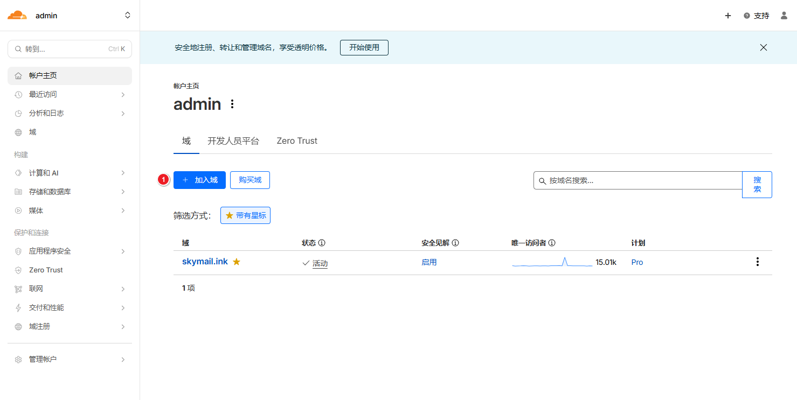
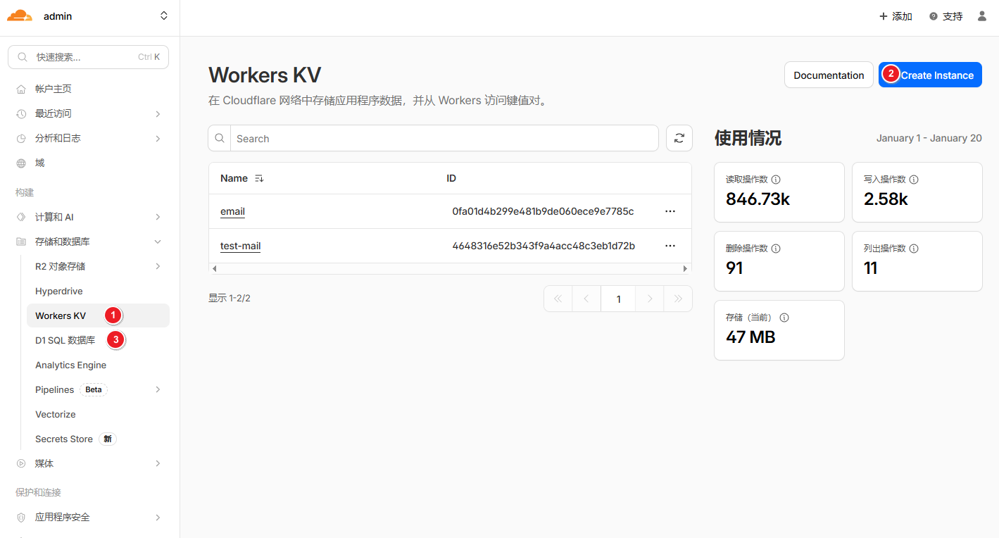
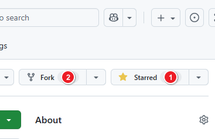
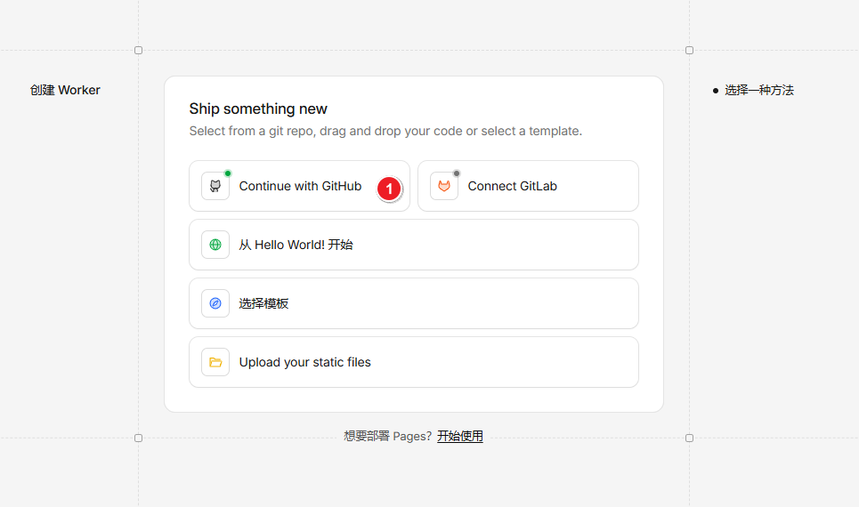
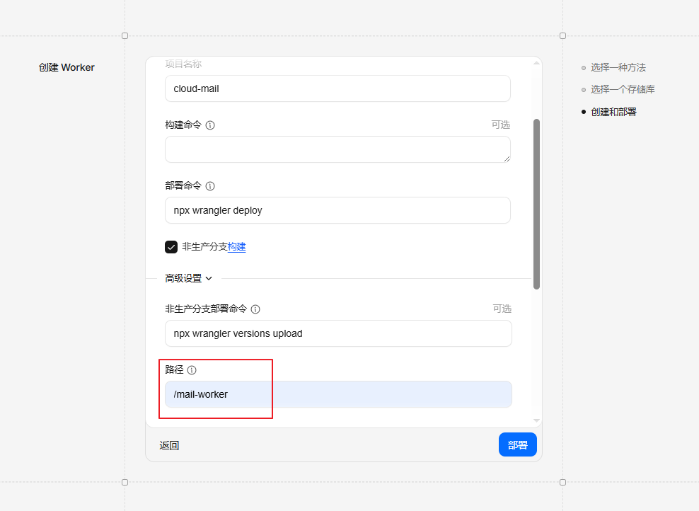
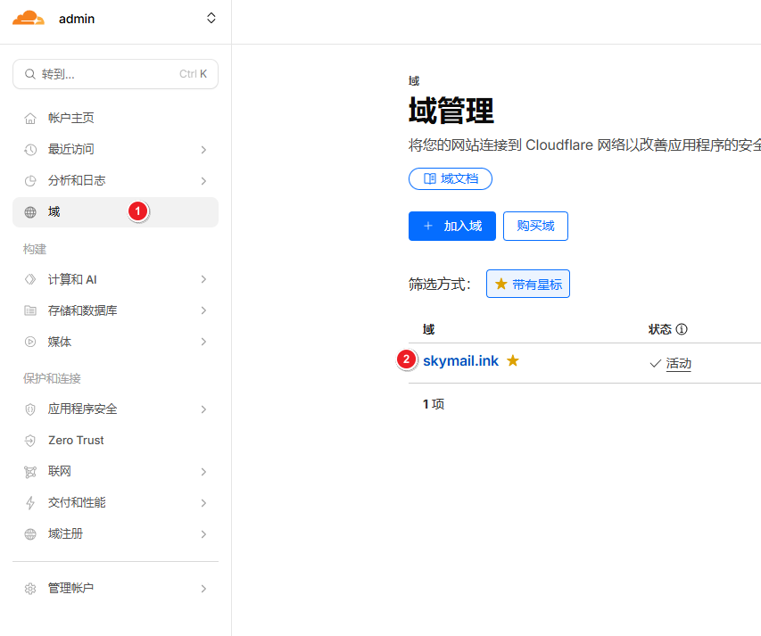
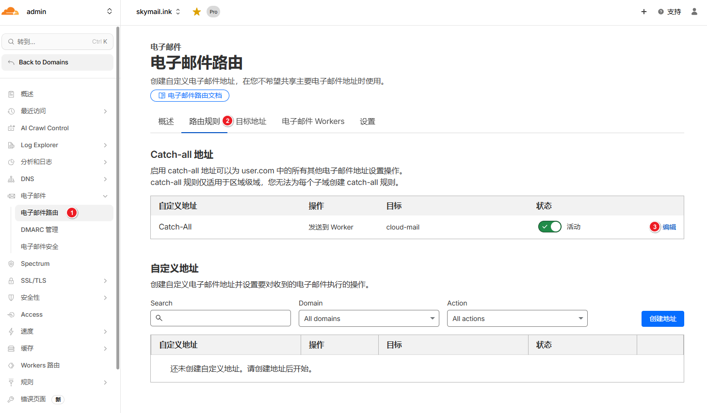
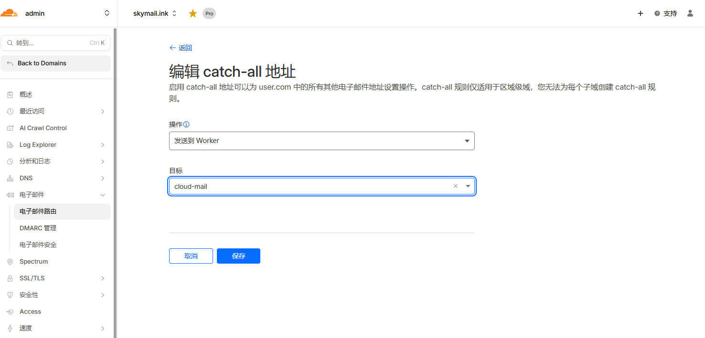

# 部署教程

从零把 Cloud Mail 部署到 Cloudflare Workers，并真正把邮件收发跑通。

> **和 README 的分工**：README 的「快速开始」是速查表（资源清单、环境变量全表、三种部署方式的完整参数）。本页是按顺序走一遍的图文教程，重点讲 README 没有展开的部分——**怎么让站点真的收到信、怎么开启发信、各项可选功能怎么配**。命令和变量的权威清单以 README 为准。

## 成品长这样

| | |
| --- | --- |
|  |  |
|  |  |

## 目录

- [一、开始之前](#一开始之前)
- [二、准备域名与数据库](#二准备域名与数据库)
- [三、部署 Worker](#三部署-worker)
- [四、初始化数据库与管理员](#四初始化数据库与管理员)
- [五、配置收信（不做这步收不到任何邮件）](#五配置收信不做这步收不到任何邮件)
- [六、配置发信（发信开关默认是关的）](#六配置发信发信开关默认是关的)
- [七、对象存储](#七对象存储)
- [八、可选功能](#八可选功能)
- [九、上线验收](#九上线验收)
- [十、更新与回滚](#十更新与回滚)
- [十一、排障速查](#十一排障速查)

---

## 一、开始之前

需要准备：

| 项目 | 必需 | 说明 |
| --- | :---: | --- |
| Cloudflare 账号 | ✅ | 免费套餐即可跑起来 |
| 一个域名 | ✅ | 必须托管在 Cloudflare（NS 指向 Cloudflare），否则用不了 Email Routing |
| GitHub 账号 | ✅ | 用控制台 Git 集成部署时需要 |
| Node.js 22 | 仅本地部署/开发需要 | 用控制台 Git 集成则不需要本地环境 |

整个流程大约 20 分钟，其中最容易被忽略、也最容易导致「部署成功但收不到信」的是[第五节](#五配置收信不做这步收不到任何邮件)。

**关于费用**：Workers、D1、KV 的免费额度足够个人和小团队长期自用。唯一可能产生费用的是 Workers AI（验证码 AI 兜底识别），而它默认关闭，本地正则识别已能覆盖常见验证码。R2 有免费额度，不配也能跑（见[第七节](#七对象存储)）。

---

## 二、准备域名与数据库

### 2.1 把域名添加到 Cloudflare

登录 Cloudflare 控制台，添加你的域名，并按提示把 NS 记录改到 Cloudflare。



域名状态变成 **Active** 之后再继续，否则后面的 Email Routing 用不了。

### 2.2 创建 D1 数据库和 KV 命名空间

左侧 **存储和数据库** → 分别创建一个 **D1 SQL 数据库** 和一个 **Workers KV** 命名空间。



| 资源 | 必需 | 绑定名 | 用途 |
| --- | :---: | --- | --- |
| D1 数据库 | ✅ | `db` | 邮件、用户、设置 |
| KV 命名空间 | ✅ | `kv` | 会话、缓存，也是附件的兜底存储 |
| R2 存储桶 | 可选 | `r2` | 附件对象存储 |
| Workers AI | 可选 | `ai` | 验证码 AI 兜底 |

> ⚠️ **绑定名写死在代码里，不能改**。代码直接读 `c.env.db`、`c.env.kv`、`c.env.r2`、`c.env.ai`，改名等于没绑。数据库和命名空间本身叫什么无所谓，绑定时的**变量名**必须是上表这几个。

---

## 三、部署 Worker

下面演示**控制台 Git 集成**（推荐，不需要本地环境）。另外两种方式（本地 Wrangler、GitHub Actions）的完整参数见 [README「部署方式」](../README.md#部署方式)。

### 3.1 Fork 仓库到自己的 GitHub



仓库地址：<https://github.com/deeeeeeeeap/cloud-mail-deeeeeeeeap>

### 3.2 创建 Worker 项目

**计算和 AI** → **Workers 和 Pages** → **创建应用程序**。


### 3.3 选择从 GitHub 导入



授权 Cloudflare 访问你刚 fork 的仓库。

### 3.4 填写构建与部署配置



> ⚠️ **这张图来自上游项目，其中「部署命令」和「路径」两项不适用于本仓库**，照填会部署失败。请按下表填写：

| 字段 | 本仓库应填 | 说明 |
| --- | --- | --- |
| 项目名称 | `cloud-mail` | 可自定义，但要记住——[第五节](#五配置收信不做这步收不到任何邮件)配置转发时要在下拉列表里选它 |
| 构建命令 | 留空 | 由仓库根的 `wrangler.jsonc` 自动执行 |
| 部署命令 | `node scripts/cloudflare-workers-git-deploy.mjs` | **不要填 `npx wrangler deploy`** |
| 路径 / 根目录 | 留空（仓库根） | 若你把根目录设成了 `mail-worker`，部署命令改为 `node ../scripts/cloudflare-workers-git-deploy.mjs` |

> ⚠️ 如果 Cloudflare 自动生成了一个 `Add Cloudflare Workers configuration` 的 PR，并把项目识别成 `Framework: static` / `Output Directory: mail-vue`，**不要合并**。那会把前端源码当静态站上传，导致后端和所有绑定全部失效。用仓库根目录已有的 `wrangler.jsonc`。

### 3.5 绑定 D1 和 KV

进入 Worker → **绑定** → **添加绑定**，把 2.2 创建的资源接上。


再次强调：**变量名必须是 `db` 和 `kv`**，选错名字等于没绑。

### 3.6 设置自定义域名和环境变量

进入 Worker → **设置**：

- **域和路由** → 添加你的自定义域（例如 `mail.example.com`）
- **变量和机密** → 添加下表变量

| 变量 | 必填 | 说明 |
| --- | :---: | --- |
| `domain` | ✅ | 邮箱域名 JSON 数组，如 `["example.com"]` |
| `admin` | ✅ | 管理员邮箱，如 `admin@example.com` |
| `jwt_secret` | ✅ | 登录 token 签名密钥，用随机 UUID 或更长的随机串 |
| `init_secret` | 推荐 | 初始化接口的独立密钥；不配则回退用 `jwt_secret` |

> 🔒 `jwt_secret` 和 `init_secret` 建议用 **机密（Secret）** 类型而不是纯文本，并且**分别用两个不同的随机值**——这样初始化密钥泄露不会连带影响所有人的登录态。
>
> 完整变量表（含 R2、Resend、OAuth 等可选项）见 [README「重要环境变量」](../README.md#重要环境变量)。

改完变量后重新部署一次，让新配置生效。

> 💡 **从旧部署迁移**：务必把 `D1_DATABASE_ID` / `KV_NAMESPACE_ID` / `R2_BUCKET_NAME` 填成原来的值。留空会让 Wrangler 创建新的空资源，看起来像「数据全没了」——其实旧数据还在，只是没绑上。

---

## 四、初始化数据库与管理员

打开你的自定义域名，会自动进入 `/setup` 页面。它会逐项检查部署状态：

```
部署检查
  D1 数据库绑定      已就绪 / 未配置
  KV 命名空间绑定    已就绪 / 未配置
  邮箱域名变量        已就绪 / 未配置
  管理员邮箱变量      已就绪 / 未配置
  初始化密钥          已就绪 / 未配置
  数据库结构          已就绪 / 未配置
  管理员账户          已就绪 / 未配置
```

有「未配置」的项，先回第三步补齐再点「重新检测」。全部就绪后，页面会给出两条命令，依次执行：

1. **初始化数据库结构** —— `POST /api/init`
2. **创建管理员账户** —— `POST /api/init/admin`（邮箱取自 `admin` 变量，密码 6–30 位）

页面上有「复制命令」按钮，复制到 PowerShell 执行即可。命令会以**隐藏输入**的方式询问初始化密钥和管理员密码，不会把真实值写进命令历史，`/setup` 页面本身也不读取、不保存这些值。

> 🔒 **本项目的初始化方式和上游不同**。上游是在浏览器地址栏访问 `https://域名/api/init/<密钥>` —— 这会把密钥留在浏览器历史、Referer 和各级访问日志里。本项目改为 `POST` + `X-Cloud-Mail-Init-Secret` 请求头，密钥只存在于你终端的这一次调用中。**如果你看到某处教程让你把密钥拼在 URL 里，那是旧写法，不适用于本项目。**

完成后用 `admin` 变量里的邮箱和刚设置的密码登录。

---

## 五、配置收信（不做这步收不到任何邮件）

**部署成功、能登录后台，不等于能收到邮件。** 还需要明确告诉 Cloudflare「把发到这个域名的信交给这个 Worker」——这一步在 Email Routing 里做，和部署是两件独立的事。

### 5.1 启用 Email Routing

Cloudflare 控制台 → 选择你的域名 → 左侧 **电子邮件** → **Email Routing** → 启用。

Cloudflare 会自动添加所需的 MX 和 TXT 记录。**如果域名之前配过别家邮箱服务的 MX 记录，要先清掉**，否则信会继续走到旧服务去。



### 5.2 把邮件路由到 Worker

在 **路由规则** 页面找到 **Catch-all address**（全部邮件地址），编辑它：



把操作（Action）设为 **发送到 Worker**，然后在下拉列表里选择你的 Worker：



- 用 **Catch-all**（推荐）：整个域名下任意前缀都能收信，这样才能在后台随意创建新邮箱。
- 只想开放特定几个地址：用 **自定义地址** 逐个添加，操作同样选「发送到 Worker」。

> 💡 下拉列表里的 Worker 名字就是 3.4 填的项目名称（默认 `cloud-mail`）。**如果列表里找不到**，说明 Worker 还没部署成功，回到第三步检查。

### 5.3 确认域名变量已登记

环境变量 `domain` 必须包含你刚配置的域名：

```
domain = ["example.com"]
```

多域名就写多个。这个变量决定系统认为哪些域名「属于自己」——它同时影响收信校验和发信时的站内/站外判断。

### 5.4 确认收信开关

后台 → 系统设置 → 邮件设置 → **收信**。全新安装默认**开启**，一般不用动。

### 5.5 验证

从外部邮箱（比如 QQ 邮箱）发一封到 `任意前缀@你的域名`，几秒内应该出现在收件箱。

### 5.6 收不到信怎么查

Worker 拒收时会给发件方退信，**退信里的英文短语直接对应拒收原因**：

| 退信文案 | 原因 | 怎么处理 |
| --- | --- | --- |
| `Service suspended` | 后台「收信」开关被关了 | 系统设置里打开 |
| `Too many attachments` | 单封邮件附件超过 10 个 | 硬限制，让发件方拆分 |
| `Message rejected` | 命中黑名单（发件人／主题／正文） | 检查系统设置里的黑名单规则 |
| `Recipient not found` | 收件地址没有对应邮箱账号，且「无收件人」策略为拒收 | 先创建该邮箱，或把策略改为接收 |
| `The recipient is not authorized to use this domain.` | 该用户的角色没有这个域名的权限 | 角色管理里给角色加上可用域名 |
| `The recipient is disabled from receiving emails.` | 该用户的角色把这个发件人拉黑了 | 角色管理里检查禁收名单 |

**完全没有退信、也没进收件箱**，说明邮件根本没到 Worker：回头检查 5.1 和 5.2，重点看 MX 记录是否生效、Catch-all 的操作是不是真的指向了 Worker。

---

## 六、配置发信（发信开关默认是关的）

> ⚠️ **全新安装后发信是关闭状态**。数据库 `send` 字段默认值为 `1`（关闭），初始化脚本也不会改它。这是「部署完发不出信」最常见的原因。

### 6.1 打开发信开关

后台 → 系统设置 → 邮件设置 → **发信**，打开。

### 6.2 选择发信通道

系统有三条通道，**选择逻辑是自动的，优先级不可配**：

```
收件人全部是本站域名  →  站内直投（不走任何外部服务）
        ↓ 否则
绑定了 send_email      →  Cloudflare Email Routing 发信
        ↓ 否则
按发件域名匹配到 token →  Resend
        ↓ 否则
                          报错「没有可用的发信服务」
```

两个**反直觉**的点：

- **只要收件人里有一个站外地址，整封信就走外部通道**，其中的站内收件人不会另走站内投递。
- **绑定了 `send_email` 之后，Resend 永远不会被使用**，即使该域名配了 Resend token。想用 Resend 就不要绑 `send_email`。

两条外部通道的差别：

| | Cloudflare Email Routing | Resend |
| --- | --- | --- |
| 配置位置 | `wrangler.toml` 的 `[[send_email]]`，binding 名必须是 `email` | 后台系统设置里的 Resend Token 列表 |
| 单封大小上限 | 5 MiB | 40 MB |
| 发送后状态 | 直接标记为「已投递」 | 先标记「已发送」，靠 webhook 推进到最终状态 |
| 收件人限制 | 受 Cloudflare 平台约束，通常只能发给已验证的 destination | 无此限制 |

> 收件人限制来自 **Cloudflare 平台本身**，不是本项目的代码逻辑，具体以 Cloudflare Email Workers 文档为准。实践上它更适合自用（收件人固定），要给任意外部地址发信请用 Resend。

### 6.3 配置 Resend

1. 在 [Resend](https://resend.com) 注册，添加并验证你的发信域名。
2. 创建 API Key。
3. 后台 → 系统设置 → Resend Token 列表 → 添加，**key 填裸域名**（如 `example.com`，不带 `@`），value 填 API Key。

映射关系是**发件账号的域名 → token**。如果某个域名没出现在这个列表里，用该域名的邮箱就没有发信能力——这和 `domain` 环境变量里有没有它无关，两者独立。

> 🔒 Token 和其他凭据字段一样，**只有 `admin` 变量里那个邮箱本人能修改**，其他管理员会收到 403。页面上回显的值是打码的（前 12 位 + `******`），不是真实 token。

### 6.4 配置 Resend Webhook（推荐）

不配也能发信，但发出去之后的状态（送达／退信／投诉）无法回传，邮件会一直停在「已发送」。

1. Resend 控制台 → Webhooks → 添加，URL 填 `https://你的域名/api/webhooks`（**注意要带 `/api`**）。
2. 复制 Resend 给出的签名密钥（`whsec_` 开头），填到环境变量 `resend_webhook_secret`。

签名校验默认**强制**：缺少 `svix-*` 请求头、时间戳超出 ±300 秒、或签名不匹配，都返回 401。

> `resend_webhook_allow_unsigned=true` 只在**完全没配 secret** 时才生效，用于兼容旧部署。一旦配了 secret，这个开关不起任何作用，不能用它绕过校验。

### 6.5 发信限额

限额配在**角色**上（后台 → 角色管理），不在系统设置里：

| 类型 | 含义 |
| --- | --- |
| `ban` | 禁止发信 |
| `internal` | 只能发站内 |
| `count` | 总量限制，**永不自动重置**，需管理员手动重置 |
| `day` | 每日限制，每天 UTC 16:00（东八区次日 00:00）自动重置 |

计数按**收件人个数**累加，不是按封数——一封发给 3 个人的邮件算 3 次。上限填 `0` 表示不限。

`admin` 变量里的那个邮箱不受角色限额和域名权限约束。

---

## 七、对象存储

用来存附件、正文内嵌图片和登录页背景图。

### 7.1 三种后端与选择顺序

```
S3 四项配置齐全  →  用 S3
        ↓ 否则
绑定了 r2        →  用 R2
        ↓ 否则
                    用 KV（兜底，永远可用）
```

**不存在「没配对象存储」这种状态**——KV 是必需绑定，所以最低配置下附件会写进 KV，收信一切正常。

两个要注意的点：

- **S3 优先级高于 R2**。四个 S3 字段一旦填齐，即使绑了 R2 也会走 S3。
- **切换后端不会迁移已有文件**。切换后旧附件将读不到，代码里没有迁移逻辑。

### 7.2 各后端的配置

| 后端 | 配置位置 | 配置项 |
| --- | --- | --- |
| R2 | Worker 绑定 | binding 必须是 `r2` |
| S3 兼容 | 后台系统设置 | `bucket`、`endpoint`、`s3AccessKey`、`s3SecretKey` 四项**必须全填**才会启用；`region`（留空按 `auto`）和 `forcePathStyle` 可选 |
| KV | 无需配置 | 复用必需的 `kv` 绑定 |

用 KV 兜底要知道它的限制：**Cloudflare KV 单个值上限 25 MiB**，且代码没有分片。超过这个大小的附件会写入失败，导致整封邮件被标记为接收失败并给发件方退信（不会静默丢附件）。附件多、体积大的场景建议配 R2。

### 7.3 R2 自定义域名

系统设置里的 `r2Domain` 是给**正文内嵌图片生成可访问 URL** 用的，不影响附件的读写路径。

> 别和 `customDomain` 搞混：后者是 **Worker 的自定义域名**，用于 Telegram「查看」按钮和 Turnstile 校验，和对象存储无关。

---

## 八、可选功能

以下功能**全新安装后默认全部关闭**，按需开启。

### 8.1 Turnstile 人机验证

后台 → 系统设置 → Turnstile，填 Site Key 和 Secret Key（在 Cloudflare 控制台的 Turnstile 页面创建 widget 获得）。

> ⚠️ Turnstile widget 配置的域名**必须和站点域名一致**，服务端会校验 hostname，不匹配则永远验证失败。
>
> 🔒 两个 Key 同样是凭据字段，只有 `admin` 那个邮箱能改；Secret Key 永不回传前端。

有两个独立开关——**注册验证**和**添加邮箱验证**，各有三种模式：

| 模式 | 行为 |
| --- | --- |
| 启用 | 每次都要求验证 |
| 禁用 | 完全关闭 |
| **规则验证** | 按**来源 IP 每日计数**：同一 IP 前 N 次免验证，第 N 次之后才要求验证 |

「规则验证」的阈值 N 在开关旁边的齿轮里设置，最小值 1。计数表每天 UTC 16:00 由定时任务清空，所以是**每日额度**而非永久累计。

### 8.2 邮件转发

后台 → 系统设置 → 邮件推送。开启后，收到的邮件会通过 Cloudflare Email Routing 转发到你指定的邮箱。

- **目标地址必须已在 Cloudflare Email Routing 中验证过**，否则转发失败。
- 两种模式：**全部转发**，或**按规则**（只转发投递到白名单收件地址的邮件）。
- 转发失败**不影响收信**，邮件已经先入库了，失败只记日志。

> ⚠️ **一个容易踩的坑**：「转发规则」实际上**同时门控 Telegram 推送**，不只是邮箱转发。开启规则模式后，不在白名单里的邮件既不会转发，也不会推送到 TG。

### 8.3 LinuxDo OAuth 登录

全部通过**环境变量**配置，后台设置页没有这一项：

| 变量 | 说明 |
| --- | --- |
| `linuxdo_switch` | 总开关，填 `"true"` 才启用 |
| `linuxdo_client_id` | LinuxDo 应用的 client id |
| `linuxdo_client_secret` | **必须作为 Secret 存放**，不要写进 toml |
| `linuxdo_callback_url` | 回调地址，填**站点登录页 URL**，如 `https://mail.example.com/login` |
| `oauth_auto_register` | 可选，填 `true` 时 OAuth 新用户可绕过站点注册开关 |

在 LinuxDo 应用后台注册的回调地址要和 `linuxdo_callback_url` 完全一致。

首次用 LinuxDo 登录且还没有邮箱的用户，会弹出绑定框选择邮箱前缀；如果站点开了注册码要求，绑定时仍需填注册码。开关关闭时，三个 OAuth 公开入口都返回 403，无法绕过页面直接调 API。

> 代码里会记录 LinuxDo 的信任等级等信息，但**没有任何按信任等级放行或拒绝的逻辑**——实际门禁是站点的注册开关和注册码。

### 8.4 Telegram 推送

后台 → 系统设置 → 邮件推送 → TG Bot，填 Bot Token 和 Chat ID（多个用逗号分隔），然后打开开关。

- 收到新邮件时推送，消息带一个「查看」按钮；如果该邮件识别出了验证码，还会多一个一键复制按钮。
- 「查看」按钮的链接需要配置 `customDomain`（Worker 自定义域名），否则按钮会指向 Cloudflare 的 404 页。
- 推送失败不影响收信。

> 🔒 「查看」链接里带一个 **24 小时有效的令牌，任何拿到链接的人都能读该封邮件正文**。注意 TG 群的可见范围。

### 8.5 验证码中心

**开箱即用，不需要任何配置，也不产生费用。** 本地正则识别是无条件执行的，与任何开关无关。

AI 只是可选兜底：只有在**开启了 AI 开关**且**正则没识别出结果**时才会调用 Workers AI。AI 开关默认关闭；即使打开，Worker 没绑定 `ai` 时也会静默降级，不会报错。开启后消耗 Cloudflare Workers AI 用量，可以用「AI 识别过滤」限定只对特定发件域名启用，进一步控制成本。

---

## 九、上线验收

按顺序确认：

1. 部署日志里能看到 `env.db`、`env.kv`、`env.assets` 绑定。
2. `/setup` 显示 D1、KV、`domain`、`admin`、`jwt_secret` 均已就绪。
3. 能用管理员邮箱登录后台。
4. 后台 → 维护中心，检查 D1 / KV / R2 / AI / 发信绑定状态。
5. 从外部邮箱发一封测试邮件，能收到。
6. 后台发一封给外部邮箱，能发出。
7. 附件能上传、能下载。

维护中心的修复操作**按风险分了三档**：

| 风险 | 操作 | 说明 |
| --- | --- | --- |
| 🟢 安全 | 补齐数据库结构、补齐索引、重新扫描验证码 | 幂等，可反复执行 |
| 🟡 谨慎 | 核对外发状态、恢复收信、重建搜索表、清理误判验证码 | 会改数据，但只做确定性修正 |
| 🔴 高风险 | 把 UNKNOWN 投递判定为成功/失败、清理过期验证码 | **人工判定，不可撤销**，只在明确知道后果时使用 |

「核对外发状态」只修复本地数据库记录，不会重新调用发信服务商，不会造成重复发送。

---

## 十、更新与回滚

**更新**：

1. 同步 fork 并重新部署（Git 集成的话推送即可）。
2. 部署完成后，**必须执行一次数据库升级**——调用受保护的 `POST /api/init`，或在维护中心点「补齐数据库结构」和「补齐索引」。新版本引入的表和索引不会自动创建。
3. 升级完成前，启动检查会把数据库报告为 `ready=false`，这是正常的。

升级是幂等的，不会删除或改写现有的邮件、用户和附件。

> 如果历史数据里存在重复的 OAuth 身份或重复的投递记录，修复会以 `409` 明确停止，**不会静默合并或删除**。这时需要人工核对保留正确记录后再重试，不要直接在生产 D1 上手工改数据。

**回滚**：Cloudflare 控制台的 Workers 页面可以回滚到之前的部署版本。但要注意**数据库结构不会跟着回滚**——新版本加的表和列会留下。通常这不影响旧版本运行（旧代码不读新列），但跨大版本回滚前建议先确认。

---

## 十一、排障速查

### 全新安装后各开关的默认状态

这张表能解释大部分「功能不生效」的困惑：

| 功能 | 默认状态 |
| --- | --- |
| 收信 | ✅ 开启 |
| **发信** | ❌ **关闭** |
| 邮件转发 | ❌ 关闭 |
| Telegram 推送 | ❌ 关闭 |
| 验证码 AI 兜底 | ❌ 关闭（本地正则识别始终启用） |
| 注册验证 / 添加邮箱验证 | ❌ 关闭 |

### 常见问题

| 现象 | 最可能的原因 |
| --- | --- |
| 收不到任何邮件 | Email Routing 没配路由规则，见[第五节](#五配置收信不做这步收不到任何邮件) |
| 收到退信，带英文短语 | 对照 [5.6 的退信文案表](#56-收不到信怎么查) |
| 发信报「没有可用的发信服务」 | 既没绑 `send_email`，Resend token 列表里也没有该发件域名 |
| 点发送没反应／提示已禁用 | 发信总开关没开，或角色的发信类型是 `ban`／`internal` |
| 邮件一直停在「已发送」 | Resend webhook 没配，状态无法回传 |
| 附件上传失败 | 用 KV 兜底且文件超过 25 MiB，配 R2 解决 |
| 内嵌图片显示不出来 | 检查系统设置里的 R2 自定义域名 |
| 部署后打开是一堆源码 / 绑定全丢 | 合并了 Cloudflare 自动生成的 `wrangler.jsonc` PR，见 [3.4](#34-填写构建与部署配置) |
| 登录页 GitHub 角标不见了 | `project_link` 被设成了 `false` 或非 http(s) 值 |

更多排障条目见 [README](../README.md) 的「常用排障」一节。

---

## 图片来源

第二、三、五节中的 Cloudflare 控制台截图取自上游项目 [maillab/cloud-mail](https://github.com/maillab/cloud-mail) 的部署文档（MIT 许可）。这些界面是 Cloudflare 通用界面，与具体项目无关。

上游文档中演示初始化和管理员注册的截图**未被采用**——本项目的初始化流程已改为受请求头保护的 `POST` 调用，与图中展示的旧方式不同，照做会失败。
